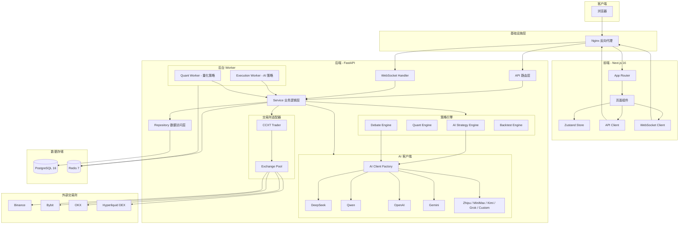
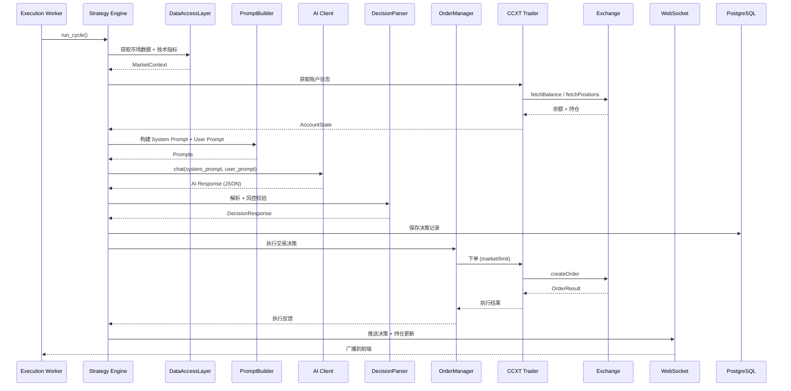
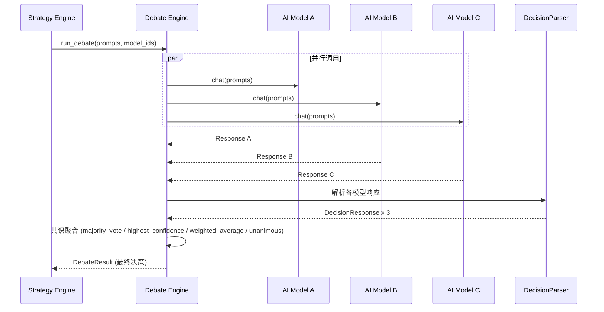
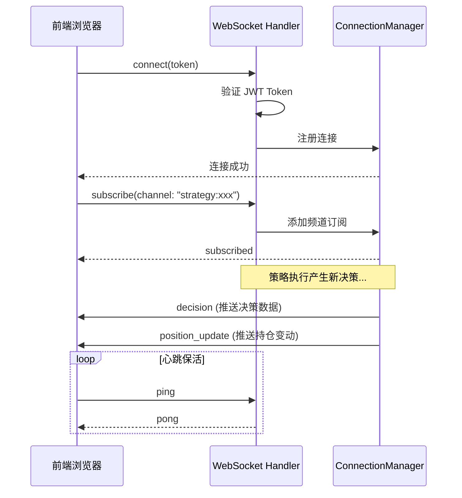

# 架构概览

本文档描述 BITRUN 的整体系统架构、模块划分、核心数据流和技术选型。

## 系统架构图

## 模块职责划分

### 后端分层架构

BITRUN 后端采用经典的分层架构，自上而下分为五层：

| 层级 | 目录 | 职责 |
|------|------|------|
| **API 路由层** | `app/api/routes/` | HTTP/WebSocket 入口，请求校验，响应序列化，速率限制 |
| **Service 业务逻辑层** | `app/services/` | 核心业务编排，策略执行、AI 调用、Prompt 构建、订单管理 |
| **Repository 数据访问层** | `app/db/repositories/` | 数据库 CRUD 操作封装，SQL 查询抽象 |
| **Trader 交易适配层** | `app/traders/` | 交易所统一接口，通过 CCXT 驱动所有支持的交易所 |
| **Worker 后台任务层** | `app/workers/` | 定时策略执行，支持进程内 (legacy) 和分布式 (ARQ) 两种模式 |

### 后端核心模块

| 模块 | 文件 | 说明 |
|------|------|------|
| **StrategyEngine** | `services/strategy_engine.py` | AI 策略执行引擎：构建 Prompt → 调用 AI → 解析决策 → 执行交易 |
| **PromptBuilder** | `services/prompt_builder.py` | 8 段式 Prompt 构建器：角色定义、交易模式、风控约束、技术指标等 |
| **DecisionParser** | `services/decision_parser.py` | AI 响应解析器：JSON 提取、风控校验、决策标准化 |
| **DebateEngine** | `services/debate_engine.py` | 多模型辩论引擎：并行调用多个 AI → 投票 / 加权聚合 → 共识决策 |
| **QuantEngine** | `services/quant_engine.py` | 量化策略引擎：Grid / DCA / RSI 策略实现 |
| **OrderManager** | `services/order_manager.py` | 订单生命周期管理：下单、重试、止盈止损 |
| **AIClientFactory** | `services/ai/factory.py` | AI 客户端工厂：按 `provider:model_id` 创建对应客户端实例 |
| **CCXTTrader** | `traders/ccxt_trader.py` | CCXT 统一交易适配器：驱动所有 CEX + Hyperliquid |
| **ExchangePool** | `traders/exchange_pool.py` | 交易所连接池：复用 CCXT 实例，减少连接开销 |
| **BacktestEngine** | `backtest/engine.py` | 回测引擎：历史数据回放 → 模拟交易 → 统计指标 |
| **DataAccessLayer** | `services/data_access_layer.py` | 统一数据访问：K 线、技术指标、市场数据 |
| **ConnectionManager** | `api/websocket.py` | WebSocket 连接管理器：频道订阅、消息广播、心跳检测 |

### 前端核心模块

| 模块 | 目录 | 说明 |
|------|------|------|
| **页面路由** | `app/[locale]/(dashboard)/` | Dashboard、Agents、Strategies、Accounts、Models、Backtest、Decisions、Settings |
| **策略工作室** | `components/strategy-studio/` | 可视化策略配置：Coins / Indicators / Risk / Prompt / Debate 五个 Tab |
| **API 客户端** | `lib/api/client.ts` | 统一 HTTP 客户端，JWT 自动刷新，错误处理 |
| **WebSocket** | `hooks/use-websocket.ts` | 实时数据推送，自动重连，频道订阅 |
| **状态管理** | `stores/` | Zustand：auth-store (认证状态)、app-store (应用状态) |
| **国际化** | `messages/` + `i18n/` | next-intl 中英文双语 |

## 核心数据流

### AI 策略执行流程

### Debate Engine 多模型辩论流程

### WebSocket 实时推送流程

## 技术选型理由

### 后端：FastAPI + PostgreSQL + Redis

| 选型 | 理由 |
|------|------|
| **FastAPI** | 原生 async/await 支持，适合 IO 密集的交易场景（交易所 API 调用、AI API 调用）；自动 OpenAPI 文档生成；Pydantic 模型校验 |
| **PostgreSQL** | 成熟的关系型数据库，JSONB 类型灵活存储策略配置和 AI 决策数据；强事务保证交易记录一致性 |
| **SQLAlchemy 2.0 + asyncpg** | 异步 ORM，配合 FastAPI 全链路异步；asyncpg 是最快的 PostgreSQL Python 驱动 |
| **Redis** | 多用途：市场数据缓存（减少交易所 API 调用）、JWT Token 黑名单、速率限制、ARQ 任务队列 |
| **ARQ** | 轻量级异步任务队列，基于 Redis，与 FastAPI 的 async 生态无缝集成 |

### 前端：Next.js + Zustand + SWR

| 选型 | 理由 |
|------|------|
| **Next.js 16 (App Router)** | 服务端渲染加速首屏、文件系统路由简化路由管理、Middleware 实现服务端认证守卫 |
| **Zustand** | 极简状态管理，比 Redux 轻量，支持 persist 中间件持久化认证状态 |
| **SWR** | 自动缓存 + 重新验证，适合实时性要求高的交易数据展示 |
| **Radix UI + Tailwind CSS** | 无障碍的 headless 组件 + 原子化 CSS，快速构建一致的 UI |
| **next-intl** | Next.js 官方推荐的国际化方案，支持 App Router |

### 交易对接：CCXT 统一接口

| 选型 | 理由 |
|------|------|
| **CCXT** | 统一 API 封装 100+ 交易所差异，一套代码驱动 Binance、Bybit、OKX、Hyperliquid |
| **单一 CCXTTrader** | 所有交易所通过同一个适配器类驱动，交易所差异通过配置而非子类处理，降低维护成本 |
| **ExchangePool** | 连接池复用 CCXT 实例，避免每次请求重新创建连接，提升性能 |

### AI 集成：Provider 级别配置 + 工厂模式

| 选型 | 理由 |
|------|------|
| **AIClientFactory** | 工厂模式按 `provider:model_id` 动态创建客户端，新增 Provider 只需添加客户端实现 |
| **数据库存储 API Key** | API Key 不写环境变量，通过应用内配置，AES-256-GCM 加密存储，支持多用户各自配置 |
| **Debate Engine** | 多模型投票/加权聚合机制，利用不同模型的多样性提升决策鲁棒性 |

### 基础设施：Docker + Nginx

| 选型 | 理由 |
|------|------|
| **Docker Compose** | 一键编排所有服务 (前端 + 后端 + PostgreSQL + Redis + Nginx)，开发/生产配置分离 |
| **Nginx** | 反向代理统一入口，内置速率限制 (API 30r/s, WebSocket 5r/s)、安全头、Gzip 压缩 |
| **Sentry** | 前后端统一错误追踪，Session Replay 辅助定位前端问题 |
| **Prometheus** | 指标采集，配合 Grafana 监控系统运行状态 |
