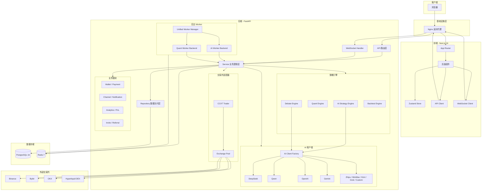
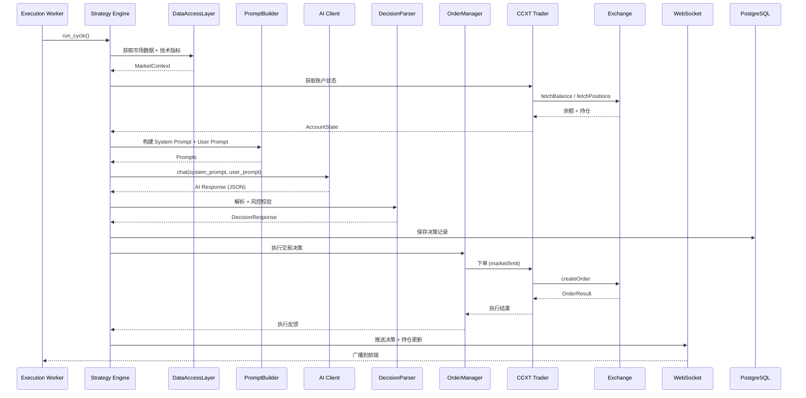
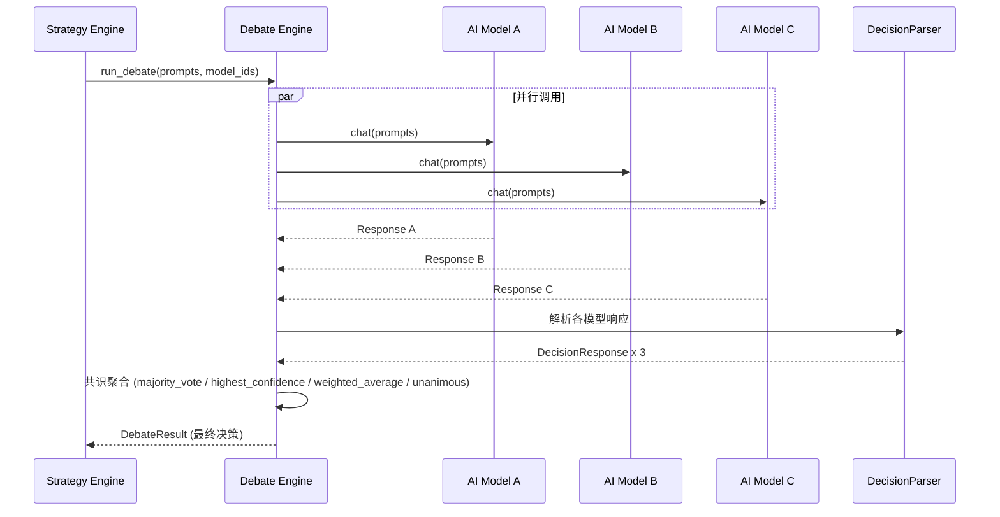
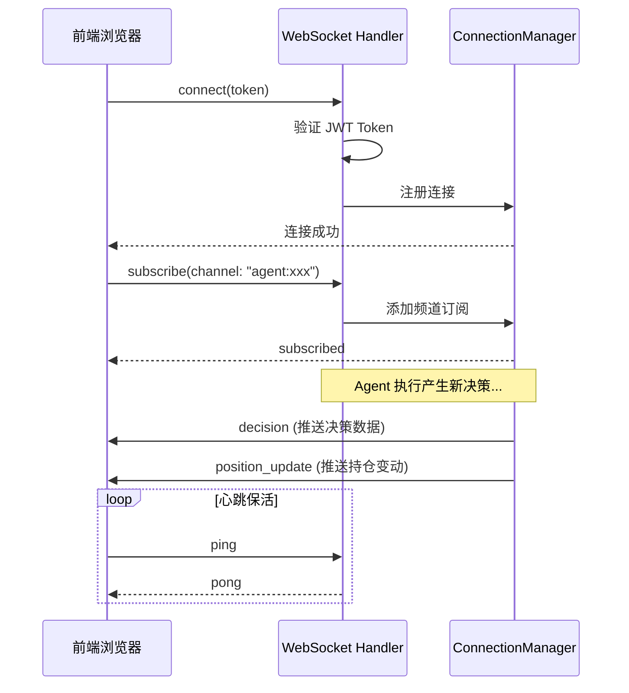

# 架构概览

本文档描述 BITRUN 的整体系统架构、模块划分、核心数据流和技术选型。

## 系统架构图



## 模块职责划分

### 后端分层架构

BITRUN 后端采用经典的分层架构，自上而下分为五层：

| 层级 | 目录 | 职责 |
|------|------|------|
| **API 路由层** | `app/api/routes/` | HTTP/WebSocket 入口，请求校验，响应序列化，速率限制 |
| **Service 业务逻辑层** | `app/services/` | 核心业务编排，策略执行、AI 调用、Prompt 构建、订单管理 |
| **Repository 数据访问层** | `app/db/repositories/` | 数据库 CRUD 操作封装，SQL 查询抽象 |
| **Trader 交易适配层** | `app/traders/` | 交易所统一接口，通过 CCXT 驱动所有支持的交易所 |
| **Worker 后台任务层** | `app/workers/` | 统一 Worker 管理器，支持 AI 策略和量化策略执行 |

### 后端核心模块

| 模块 | 文件 | 说明 |
|------|------|------|
| **StrategyEngine** | `services/strategy_engine.py` | AI 策略执行引擎：构建 Prompt → 调用 AI → 解析决策 → 执行交易 |
| **PromptBuilder** | `services/prompt_builder.py` | 8 段式 Prompt 构建器：角色定义、交易模式、风控约束、技术指标等 |
| **DecisionParser** | `services/decision_parser.py` | AI 响应解析器：JSON 提取、风控校验、决策标准化 |
| **DebateEngine** | `services/debate_engine.py` | 多模型辩论引擎：并行调用多个 AI → 投票 / 加权聚合 → 共识决策 |
| **QuantEngine** | `services/quant_engine.py` | 量化策略引擎：Grid / DCA / RSI 策略实现 |
| **OrderManager** | `services/order_manager.py` | 订单生命周期管理：下单、重试、止盈止损 |
| **AIClientFactory** | `services/ai/factory.py` | AI 客户端工厂：按 `provider:model_id` 创建对应客户端实例 |
| **CCXTTrader** | `traders/ccxt_trader.py` | CCXT 统一交易适配器：驱动所有 CEX + Hyperliquid |
| **ExchangePool** | `traders/exchange_pool.py` | 交易所连接池：复用 CCXT 实例，减少连接开销 |
| **BacktestEngine** | `backtest/engine.py` | 回测引擎：历史数据回放 → 模拟交易 → 统计指标 |
| **DataAccessLayer** | `services/data_access_layer.py` | 统一数据访问：K 线、技术指标、市场数据 |
| **ConnectionManager** | `api/websocket.py` | WebSocket 连接管理器：频道订阅、消息广播、心跳检测 |
| **UnifiedWorkerManager** | `workers/unified_manager.py` | 统一 Worker 管理器：管理所有策略类型的后台执行 |
| **WorkerHeartbeat** | `services/worker_heartbeat.py` | Worker 心跳追踪：检测活跃状态、超时恢复 |

### 业务模块

#### Wallet / Payment 模块

用户余额和交易管理：

| 文件 | 说明 |
|------|------|
| `api/routes/wallets.py` | 钱包 API：余额查询、交易记录、摘要统计 |
| `api/routes/recharge.py` | 充值 API：创建充值订单、查询状态 |
| `services/wallet_service.py` | 钱包业务逻辑：余额管理、交易处理 |
| `db/repositories/wallet.py` | 钱包数据访问：Wallet CRUD |
| `db/repositories/recharge.py` | 充值数据访问：Recharge CRUD |

**交易类型**：
- `recharge` - 充值
- `consume` - 消费（策略执行扣费）
- `refund` - 退款
- `gift` - 赠送
- `adjustment` - 管理员调整

#### Channel / Notification 模块

通知渠道管理：

| 文件 | 说明 |
|------|------|
| `api/routes/channels.py` | 渠道 API：CRUD、测试连接 |
| `services/channel_service.py` | 渠道业务逻辑：渠道配置、消息发送 |
| `db/repositories/channel.py` | 渠道数据访问 |

**支持的通知渠道**：
- Telegram (Bot)
- Discord (Webhook)
- Email (Resend)

#### Analytics / PnL 模块

数据分析和盈亏统计：

| 文件 | 说明 |
|------|------|
| `api/routes/analytics.py` | 分析 API：盈亏报表、日快照 |
| `services/pnl_service.py` | 盈亏计算：实时 PnL、日汇总 |
| `api/routes/accounting.py` | 账务 API：账单统计 |

**数据模型**：
- `pnl_records` - 盈亏记录表
- `daily_snapshots` - 日快照表

#### Brand 模块

品牌定制和白标支持：

| 文件 | 说明 |
|------|------|
| `api/routes/brand.py` | 品牌 API：获取/更新品牌配置 |

**可配置项**：
- `brand_name` - 品牌名称
- `tagline` - 标语
- `logo_url` - Logo URL
- `theme` - 主题配置

#### Invite / Referral 模块

邀请和推荐系统：

| 文件 | 说明 |
|------|------|
| `services/invite_service.py` | 邀请逻辑：邀请码、推荐佣金 |

**功能**：
- 唯一邀请码生成
- 邀请关系追踪
- 推荐佣金计算

### 前端核心模块

| 模块 | 目录 | 说明 |
|------|------|------|
| **页面路由** | `app/[locale]/(dashboard)/` | Dashboard、Agents、Strategies、Accounts、Models、Backtest、Decisions、Analytics、Wallet、Channel、Invite、Marketplace、Settings、Admin |
| **策略工作室** | `components/strategy-studio/` | 可视化策略配置：Coins / Indicators / Risk / Prompt / Debate 五个 Tab |
| **API 客户端** | `lib/api/client.ts` | 统一 HTTP 客户端，JWT 自动刷新，错误处理 |
| **WebSocket** | `hooks/use-websocket.ts` | 实时数据推送，自动重连，频道订阅 |
| **状态管理** | `stores/` | Zustand：auth-store (认证状态)、app-store (应用状态) |
| **国际化** | `messages/` + `i18n/` | next-intl 中英文双语 |

## Worker 架构

### 统一 Worker 管理器

BITRUN 采用统一的 Worker 管理架构，支持多种策略类型：

```
UnifiedWorkerManager
├── AIWorkerBackend
│   └── AIExecutionWorker → StrategyEngine
└── QuantWorkerBackend
    └── QuantExecutionWorker → QuantEngine
```

**架构文件**：

| 文件 | 说明 |
|------|------|
| `workers/unified_manager.py` | 统一入口，管理所有 Worker Backend |
| `workers/base_backend.py` | WorkerBackend 抽象基类 |
| `workers/ai_backend.py` | AI 策略 Backend |
| `workers/quant_backend.py` | 量化策略 Backend |
| `workers/lifecycle.py` | Worker 生命周期管理 |
| `workers/queue.py` | ARQ 分布式任务队列 |
| `workers/tasks.py` | 任务定义 |

### 心跳系统

Worker 心跳用于检测 Agent 运行状态和自动恢复：

**配置参数**：

| 参数 | 默认值 | 说明 |
|------|--------|------|
| `WORKER_HEARTBEAT_INTERVAL_SECONDS` | 60 | 心跳间隔（秒） |
| `WORKER_HEARTBEAT_TIMEOUT_SECONDS` | 300 | 超时判定（秒） |

**心跳字段**（Agent 表）：
- `worker_heartbeat_at` - 最后心跳时间
- `worker_instance_id` - Worker 实例标识

**状态检测逻辑**：
1. Worker 每个执行周期更新 `worker_heartbeat_at`
2. 超过 300 秒无心跳 → 标记为 `stale`
3. 服务重启时自动恢复 `stale` 状态的 Agent

### 错误处理

Worker 配置了完善的错误恢复机制：

| 参数 | 默认值 | 说明 |
|------|--------|------|
| `WORKER_MAX_CONSECUTIVE_ERRORS` | 5 | 最大连续错误数 |
| `WORKER_ERROR_WINDOW_SECONDS` | 600 | 错误窗口（秒） |
| `WORKER_RETRY_BASE_DELAY` | 2.0 | 重试基础延迟（秒） |
| `WORKER_RETRY_MAX_DELAY` | 60.0 | 重试最大延迟（秒） |

## 核心数据流

### AI 策略执行流程



### Debate Engine 多模型辩论流程



### WebSocket 实时推送流程



## 技术选型理由

### 后端：FastAPI + PostgreSQL + Redis

| 选型 | 理由 |
|------|------|
| **FastAPI** | 原生 async/await 支持，适合 IO 密集的交易场景（交易所 API 调用、AI API 调用）；自动 OpenAPI 文档生成；Pydantic 模型校验 |
| **PostgreSQL** | 成熟的关系型数据库，JSONB 类型灵活存储策略配置和 AI 决策数据；强事务保证交易记录一致性 |
| **SQLAlchemy 2.0 + asyncpg** | 异步 ORM，配合 FastAPI 全链路异步；asyncpg 是最快的 PostgreSQL Python 驱动 |
| **Redis** | 多用途：市场数据缓存（减少交易所 API 调用）、JWT Token 黑名单、速率限制、ARQ 任务队列 |
| **ARQ** | 轻量级异步任务队列，基于 Redis，与 FastAPI 的 async 生态无缝集成 |

### 前端：Next.js + Zustand + SWR

| 选型 | 理由 |
|------|------|
| **Next.js 16 (App Router)** | 服务端渲染加速首屏、文件系统路由简化路由管理、Middleware 实现服务端认证守卫 |
| **Zustand** | 极简状态管理，比 Redux 轻量，支持 persist 中间件持久化认证状态 |
| **SWR** | 自动缓存 + 重新验证，适合实时性要求高的交易数据展示 |
| **Radix UI + Tailwind CSS** | 无障碍的 headless 组件 + 原子化 CSS，快速构建一致的 UI |
| **next-intl** | Next.js 官方推荐的国际化方案，支持 App Router |

### 交易对接：CCXT 统一接口

| 选型 | 理由 |
|------|------|
| **CCXT** | 统一 API 封装 100+ 交易所差异，一套代码驱动 Binance、Bybit、OKX、Hyperliquid |
| **单一 CCXTTrader** | 所有交易所通过同一个适配器类驱动，交易所差异通过配置而非子类处理，降低维护成本 |
| **ExchangePool** | 连接池复用 CCXT 实例，避免每次请求重新创建连接，提升性能 |

### AI 集成：Provider 级别配置 + 工厂模式

| 选型 | 理由 |
|------|------|
| **AIClientFactory** | 工厂模式按 `provider:model_id` 动态创建客户端，新增 Provider 只需添加客户端实现 |
| **数据库存储 API Key** | API Key 不写环境变量，通过应用内配置，AES-256-GCM 加密存储，支持多用户各自配置 |
| **Debate Engine** | 多模型投票/加权聚合机制，利用不同模型的多样性提升决策鲁棒性 |

### 基础设施：Docker + Nginx

| 选型 | 理由 |
|------|------|
| **Docker Compose** | 一键编排所有服务 (前端 + 后端 + PostgreSQL + Redis + Nginx)，开发/生产配置分离 |
| **Nginx** | 反向代理统一入口，内置速率限制 (API 30r/s, WebSocket 5r/s)、安全头、Gzip 压缩 |
| **Sentry** | 前后端统一错误追踪，Session Replay 辅助定位前端问题 |
| **Prometheus** | 指标采集，配合 Grafana 监控系统运行状态 |

## 相关文档

- [开发者指南](development.md) — 本地开发、代码规范、测试
- [API 参考](api-reference.md) — REST API、WebSocket API
- [部署指南](deployment.md) — 生产环境部署
- [Live / Mock 统一架构](live-mock-unified-architecture.md) — 实盘/模拟盘统一执行链路与扩展规范
