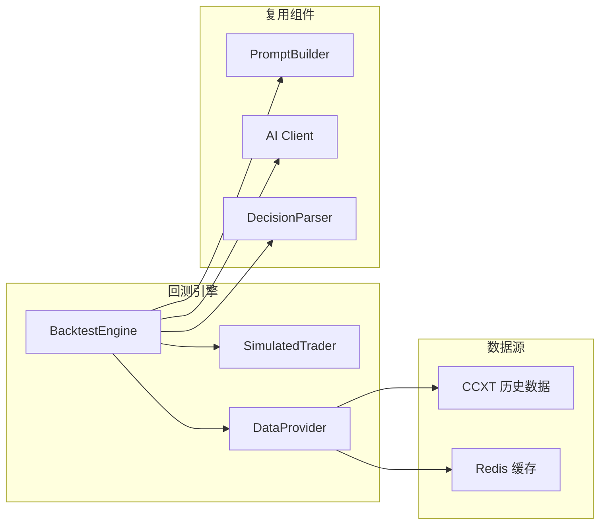

# 回测模块文档

回测 (Backtesting) 是在历史数据上模拟策略执行的过程，用于在实盘前评估策略的潜在表现。

## 回测引擎架构

回测系统由三个核心组件组成：



### BacktestEngine

回测主编排器，负责：
- 加载策略配置
- 按时间步进回放历史数据
- 调用 `PromptBuilder` 构建 Prompt
- 调用 AI 模型获取决策（可选，也可使用快速回测跳过 AI）
- 将决策传递给 `SimulatedTrader` 模拟执行
- 计算和汇总回测指标

### SimulatedTrader

实现 `BaseTrader` 接口的模拟交易器，特性：

- 模拟市场订单 / 限价订单
- 跟踪模拟持仓和余额
- 计算逐笔盈亏（包含手续费）
- 检查止损 / 止盈触发
- 支持杠杆交易模拟

### DataProvider

历史数据提供者，支持多种数据源：

- **CCXT** — 通过 CCXT 库获取交易所的历史 OHLCV K 线数据
- **Redis 缓存** — 已获取的数据缓存到 Redis，重复回测时直接读取
- 数据格式：OHLCV (Open, High, Low, Close, Volume)

## 配置和运行回测

### 通过界面运行

1. 进入 **「回测」** 页面
2. 选择已创建的策略，或使用快速回测配置
3. 设置回测参数：
   - 时间范围 (开始日期 ~ 结束日期)
   - 初始资金
   - 交易标的
   - K 线周期 (timeframe)
4. 点击「运行回测」

### 通过 API 运行

**策略回测** — 基于已保存的策略配置：

```bash
POST /api/v1/backtest/run
```

```json
{
  "strategy_id": "uuid-of-strategy",
  "start_date": "2025-01-01",
  "end_date": "2025-06-01",
  "initial_balance": 10000,
  "symbols": ["BTC/USDT:USDT"],
  "timeframe": "4h",
  "exchange": "binance",
  "use_ai": true
}
```

**快速回测** — 无需预先创建策略：

```bash
POST /api/v1/backtest/quick
```

```json
{
  "symbols": ["BTC/USDT:USDT", "ETH/USDT:USDT"],
  "start_date": "2025-01-01",
  "end_date": "2025-06-01",
  "initial_balance": 10000,
  "max_leverage": 3,
  "max_position_ratio": 0.3,
  "timeframe": "4h",
  "exchange": "binance"
}
```

### 回测参数说明

| 参数 | 类型 | 必填 | 说明 |
|------|------|------|------|
| `strategy_id` | UUID | 策略回测必填 | 要回测的策略 ID |
| `start_date` | string | 是 | 回测开始日期 (YYYY-MM-DD) |
| `end_date` | string | 是 | 回测结束日期 (YYYY-MM-DD) |
| `initial_balance` | float | 否 | 初始资金，默认 10000 USD |
| `symbols` | list | 否 | 交易标的列表（不填则使用策略配置的标的） |
| `timeframe` | string | 否 | K 线周期，默认 `4h`，可选 `1m` / `5m` / `15m` / `1h` / `4h` / `1d` |
| `exchange` | string | 否 | 数据来源交易所，默认 `binance` |
| `use_ai` | bool | 否 | 是否调用 AI 生成决策 (会消耗 API 额度) |

## 回测指标说明

回测结果包含以下核心指标：

### 收益指标

| 指标 | 说明 |
|------|------|
| **Total Return (%)** | 总收益率 = (最终资金 - 初始资金) / 初始资金 |
| **Final Balance** | 回测结束时的总资金 |
| **Total Fees** | 总交易手续费 |

### 风险指标

| 指标 | 说明 |
|------|------|
| **Max Drawdown (%)** | 最大回撤 — 从高点到低点的最大跌幅，衡量最坏情况下的亏损 |
| **Sharpe Ratio** | 夏普比率 — 超额收益 / 收益标准差，衡量风险调整后收益 (>1 为好, >2 为优秀) |
| **Sortino Ratio** | 索提诺比率 — 类似夏普比率，但只考虑下行波动 |
| **Calmar Ratio** | 卡尔马比率 — 年化收益 / 最大回撤 |
| **Recovery Factor** | 恢复因子 — 净利润 / 最大回撤金额 |

### 交易统计

| 指标 | 说明 |
|------|------|
| **Total Trades** | 总交易次数 |
| **Win Rate (%)** | 胜率 = 盈利交易数 / 总交易数 |
| **Profit Factor** | 盈亏比 = 总盈利 / 总亏损 (>1 为盈利系统, >2 为优秀) |
| **Avg Win / Avg Loss** | 平均盈利 / 平均亏损金额 |
| **Max Consecutive Wins** | 最大连胜次数 |
| **Max Consecutive Losses** | 最大连亏次数 |
| **Avg Holding Time** | 平均持仓时间 |

### 可视化数据

回测结果还包含以下图表数据：

- **Equity Curve** — 权益曲线，展示资金随时间的变化
- **Drawdown Curve** — 回撤曲线，展示每个时点的回撤幅度
- **Monthly Returns** — 月度收益率表
- **Symbol Breakdown** — 各标的的单独收益统计

## 数据源说明

### CCXT 历史数据

回测使用 CCXT 库从交易所获取历史 OHLCV 数据。

支持的数据源交易所：

| 交易所 | K 线单次获取上限 | 说明 |
|--------|----------------|------|
| Binance | 1500 根 | 数据最全，推荐作为默认数据源 |
| Bybit | 1000 根 | |
| OKX | 300 根 | |
| Hyperliquid | 5000 根 | |

### 数据缓存

为避免重复请求交易所 API：

1. 首次获取的数据会缓存到 Redis
2. 后续相同参数的回测直接从缓存读取
3. 可通过 API 手动预加载数据：

```bash
# 预加载指定标的数据
POST /api/v1/data/cache/preload
{
  "symbols": ["BTC/USDT:USDT"],
  "start_date": "2024-01-01",
  "end_date": "2025-01-01",
  "timeframe": "4h",
  "exchange": "binance"
}

# 预加载常用标的
POST /api/v1/data/cache/preload/common
```

### 数据限制

- 交易所历史数据通常有时间范围限制
- 较小周期 (1m, 5m) 的历史数据可能不如大周期 (4h, 1d) 完整
- 回测结果受数据质量影响，建议使用 Binance 数据

## 注意事项

- 回测结果仅供参考，**历史表现不代表未来收益**
- AI 回测会消耗 API 额度（每个时间步调用一次 AI）
- 回测不模拟滑点和深度，实际执行可能与回测有偏差
- 建议在不同时间段和市场环境下反复验证策略

## 相关文档

- [策略模块](strategy-guide.md) — 创建和配置策略
- [AI 模型配置](ai-models.md) — 配置回测使用的 AI 模型
- [API 参考](api-reference.md) — 回测 API 端点详情
