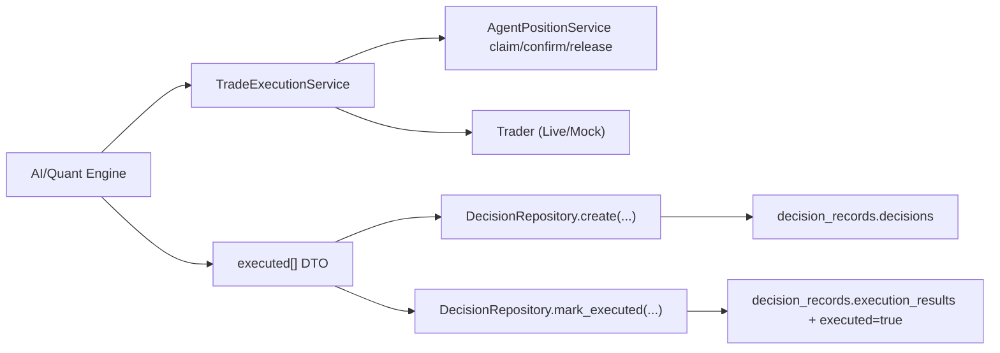
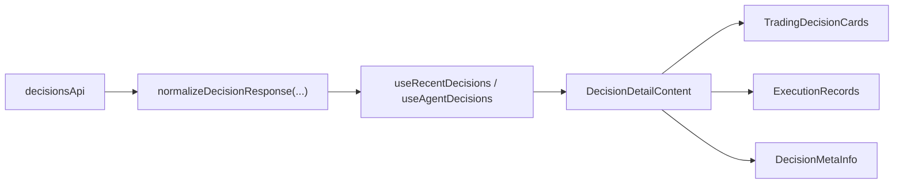

# Live / Mock 统一架构与扩展规范

本文档固化实盘（live）与模拟盘（mock）统一后的执行链路、数据契约与扩展规则，避免后续迭代再次分叉。

## 1. 统一目标

- 单一执行生命周期：`claim -> execute -> confirm/release -> persist`
- 单一执行结果 DTO：`executed[]`（引擎输出）与 `execution_results`（决策记录持久化）
- 单一读取契约：前后端都以标准字段消费（`position_size_usd` / `size_usd`、`reason` / `reasoning` 兼容）
- live/mock 仅在“交易适配器与资金约束”层存在差异，不在链路结构层分叉

## 2. 后端统一执行链路

### 2.1 核心模块（后端）

- `backend/app/services/trade_execution_service.py`
  - 统一开平仓执行与仓位隔离生命周期
  - live/mock 共用，差异通过 `trader` 与 `account_id/capital_agent` 决定
- `backend/app/services/execution_result.py`
  - 标准执行结果构造器
- `backend/app/services/quant_engine.py`
  - Grid/DCA/RSI 均产出统一 `executed[]`
- `backend/app/services/quant_decision_mapper.py`
  - 统一 `quant_result -> decision_record payload`
  - worker 与手动触发 API 共用
- `backend/app/services/decision_record_normalizer.py`
  - 读取层标准化，兼容历史记录字段

### 2.2 决策记录落库（两条入口一致）

- worker 入口：`backend/app/workers/quant_backend.py`
- 手动触发入口：`backend/app/api/routes/agents.py`

两条路径都必须满足：

1. `DecisionRepository.create(...)` 写入 `decisions`
2. 仅当真实执行发生时调用 `mark_executed(record.id, executed_results)`
3. `execution_results` 直接使用统一 DTO（不做各自私有映射）

## 3. 前端统一读取链路

### 3.1 API 层标准化

- `frontend/src/lib/api/endpoints.ts`
  - `decisionsApi.listRecent/listByAgent/listByStrategy/get` 均执行标准化
  - 保证下游拿到统一字段：
    - `decisions[].position_size_usd`
    - `execution_results[].position_size_usd/size_usd`
    - `execution_results[].reason/reasoning`

### 3.2 View-Model 与复用组件

- `frontend/src/lib/decision-view-model.ts`
  - `buildDecisionTradeRows`
  - `resolveDecisionDisplay`
  - `executionReason`
- `frontend/src/components/decisions/decision-detail-content.tsx`
  - 决策详情高层容器（快照/COT/决策卡片/执行记录/meta）
- `frontend/src/components/decisions/trading-decision-cards.tsx`
- `frontend/src/components/decisions/execution-records.tsx`
- `frontend/src/components/decisions/decision-meta-info.tsx`

## 4. 数据契约（必须保持）

### 4.1 Engine 输出契约（`executed[]`）

最小字段：

- `symbol`
- `action`
- `executed`
- `reason`（可由 normalizer 补 `reasoning`）
- `requested_size_usd` / `actual_size_usd`（至少一个）

推荐字段：

- `confidence`
- `position_leverage`
- `order_result`
- `realized_pnl`

### 4.2 Decision Record 读取契约

- `decisions[]`
  - 强制可用：`action`、`symbol`、`position_size_usd`、`reasoning`
- `execution_results[]`
  - 强制可用：`action`、`symbol`、`executed`、`position_size_usd`、`reasoning`

> 历史数据可能缺字段，必须通过 `decision_record_normalizer`（后端）和 `normalizeDecisionResponse`（前端）补齐。

## 5. 扩展规范（第 1 原则：不分叉）

新增策略（如 MACD/Bollinger）必须遵循：

1. 在引擎中继续输出统一 `executed[]`
2. 不新增专用 decision 落库分支，复用 `quant_decision_mapper`
3. 不在页面中直接解析“原始异构字段”，统一通过 API normalizer + view-model
4. 若新增执行字段，先补全：
   - 后端 normalizer 兼容
   - 前端 normalizer 兼容
   - 组件测试与页面集成测试

## 6. 回归检查清单

每次涉及执行链路变更，至少执行：

后端：

- `backend/tests/test_trade_execution_service.py`
- `backend/tests/test_quant_engine_service.py`
- `backend/tests/test_quant_backend.py`
- `backend/tests/test_quant_decision_mapper.py`
- `backend/tests/test_decision_record_normalizer.py`

前端：

- `frontend/src/__tests__/components/decision-detail-content.test.tsx`
- `frontend/src/__tests__/components/execution-records.test.tsx`
- `frontend/src/__tests__/components/trading-decision-cards.test.tsx`
- `frontend/src/__tests__/components/decision-meta-info.test.tsx`
- `frontend/src/__tests__/components/decisions-page-integration.test.tsx`
- `frontend/src/__tests__/components/agent-detail-decisions-integration.test.tsx`
- `frontend/src/__tests__/hooks/use-decisions.test.tsx`
- `frontend/src/__tests__/lib/endpoints.test.ts`
- `frontend` type-check

## 7. 常见反模式（禁止）

- 在 live/mock 分别维护两套执行结果结构
- 在 worker 和 API 里分别复制粘贴 decision 映射逻辑
- 前端页面直接依赖历史字段差异并写大量临时 fallback
- 新策略绕过 `TradeExecutionService` 直接写仓位记录

